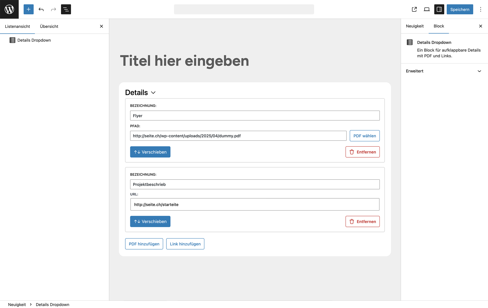
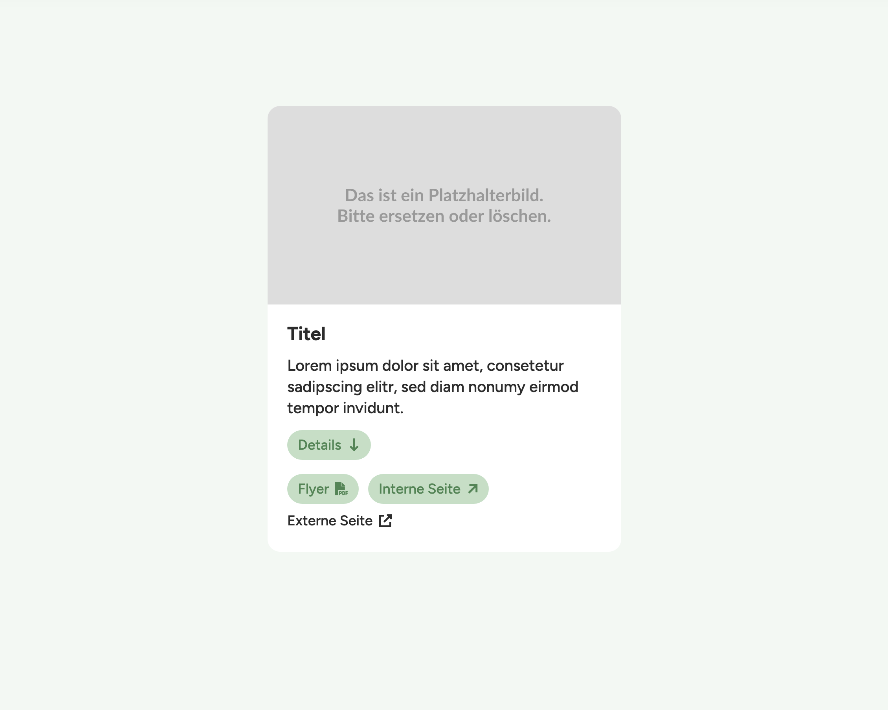

# Details Dropdown Block (WordPress Plugin)

**Ein flexibler Gutenberg-Block für aufklappbare Inhalte mit PDF- und Link-Funktionalität.**  
Dieses Plugin ermöglicht es, strukturierte Listen mit internen, externen oder PDF-Links elegant und interaktiv darzustellen – ohne Programmieraufwand, direkt im Block-Editor.

## Funktionen

- Gutenberg-Block für aufklappbare Inhalte (Details/Dropdown)
- Drag & Drop-Sortierung der Elemente
- Unterstützung für interne Links, externe Links und PDFs
- Automatische Icons je nach Linktyp
- Benutzerfreundliche Eingabemaske im Editor
- Fein anpassbares Frontend mit eigener CSS-Struktur

## Vorschau im Editor



*Abbildung: Der Block im Editor mit bearbeitbaren Feldern für Linktitel, Typ und Reihenfolge.*

## Darstellung im Frontend



*Abbildung: Die ausgeklappte Liste im Frontend – inklusive Icons für PDF und externe Links.*

## Besonderheiten

- Übersichtliche, kompakte Darstellung durch Aufklappfunktion
- Keine Shortcodes nötig – alles per UI im Editor steuerbar
- Perfekt für Inhaltsverzeichnisse, Link-Sammlungen oder Downloads
- Entwickelt mit `@wordpress/scripts

<br><br><br><br><br>
# Kurze Entwickleranleitung

Kurzanleitung zur lokalen Weiterentwicklung des Plugins.

## 1. Projekt einrichten

Lade das Plugin herunter:
Auf „Code → Download ZIP“ klicken und das Plugin entpacken.

## 2. WordPress (Docker) starten

Nutze wp-env für eine lokale WordPress-Umgebung.
Öffne ein Terminal (macOS, Linux) oder PowerShell / Git Bash (Windows):
```bash
npx @wordpress/env start
```
Das Plugin liegt dabei in wp-content/plugins/.

## 3. Abhängigkeiten installieren und entwickeln
```bash
cd /pfad/zu/deinem/plugin  #navigiere zu deinem Plugin.
npm install                #lädt benötigte Node-Modules
npm start                  # startet den Watch-Modus für /src
```
Änderungen in src/ werden automatisch nach build/ geschrieben.

## 4. Build für Live-Einsatz
```bash
npm run build
```
Erzeugt einen optimierten, produktionsfertigen Build im Ordner build/.

## 5. Welche Dateien werden benötigt?

Für den produktiven Einsatz im WordPress-Plugin-Verzeichnis werden nur die folgenden Bestandteile benötigt:

- `build/` (vom Build-Prozess generiert)
- `block.json`
- PHP-Dateien (z. B. `plugin.php`, `render.php`, etc.)
- CSS-Dateien (z. B. `style.css`, `editor.css`)
- Optional: `assets/` (z. B. für Bilder oder Icons)

Nicht erforderlich (und typischerweise ausgeschlossen):

- `node_modules/`
- `src/`
- `.git/`
- `.gitignore`
- `package.json`, `package-lock.json`
- `.editorconfig`, `.eslintrc.js` usw.

Diese Dateien sind nur für die Entwicklung relevant und sollten nicht ins produktive WordPress-Setup kopiert werden.
